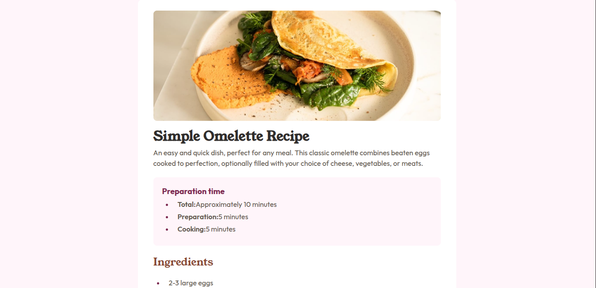
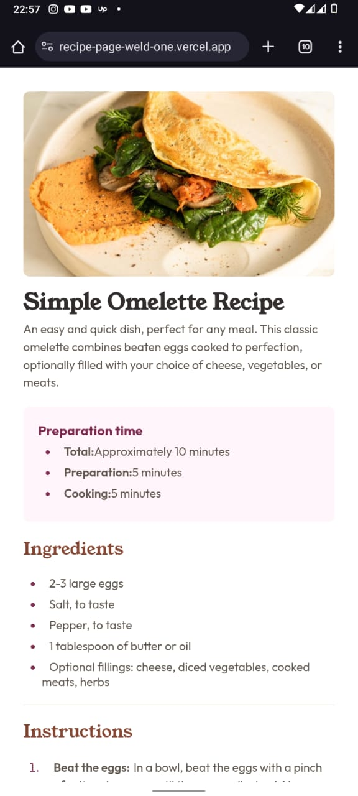

# Frontend Mentor - Recipe page solution

This is a solution to the [Recipe page challenge on Frontend Mentor](https://www.frontendmentor.io/challenges/recipe-page-KiTsR8QQKm). Frontend Mentor challenges help you improve your coding skills by building realistic projects. 

## 📸 Screenshots

  
  

## 🔗 Links

- 🧠 Solution on Frontend Mentor: [Check solution](https://www.frontendmentor.io/solutions/recipe-main-page-layout-BqaoR-Y-oz)
- 💻 Live Site: [View site](https://recipe-page-weld-one.vercel.app/)

## 🛠️ Built With

- Semantic `HTML5`
- CSS3 (with Flexbox and media queries)
- Google Fonts
- Figma 

## ✨ What I Learned

- How to center content both vertically and horizontally using `Flexbox` and `100vh`
- The BEM (Block Element Modifier) methodology for writing organized CSS
- How to use CSS child selectors effectively
- Improved my ability to translate design files into clean, accessible, and responsive codeg
- Applied media queries and flexible layouts to ensure the design looks good on different screen sizes.
- Learned how to apply font hierarchies and consistent spacing for better readability.
- Created reusable classes/components with consistent styling rules.

## 🧠 Challenges I Faced

- Understanding and implementing BEM correctly
- Fine-tuning spacing to match the design exactly
- Getting familiar with object-fit: cover for image scaling

## 🚀 Areas for Continued Development

In future projects, I aim to:

- Write cleaner and more maintainable CSS
- Get even better at pixel-perfect implementation from design tools like Figma

## 📚 Useful Resources

- [w3schools](https://www.w3schools.com/cssref/index.php) - A reliable resource I used to deepen my understanding of CSS properties such as object-fit, viewport units (`vh`, `vw`), and border styling.
- `YouTube Tutorial on CSS Tables` - I followed a YouTube tutorial to learn how to structure and style HTML tables with CSS — including table borders, spacing, and alignment — which helped me implement the nutrition section effectively.

## 👤 Author

- GitHub - [@Austinjnr](https://github.com/Austinjnr)
- Website - [Austin Obonyo](https://austinobonyo.vercel.app/)
- Frontend Mentor - [@Austinjnr](https://www.frontendmentor.io/profile/Austinjnr)
- Twitter/X - [@AustinWalkker](https://x.com/AustinWalkker)
